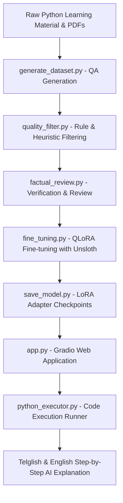

# 🐍 Python Tutor AI

An interactive, end-to-end AI programming tutor designed to explain Python concepts, assist with code debugging, and execute Python code with natural explanations in **Telglish** and **English**.

Powered by a fine-tuned **Qwen3-1.7B** model via **Unsloth (QLoRA)**, integrated with an interactive **Gradio** web interface and custom execution runner.

---

## 🔄 End-to-End ML Pipeline Architecture



---

## ✨ Key Features

- **🗣️ Telglish & English Support**: 
  - **Telglish**: Telugu conversational language written using the English/Latin alphabet, while Python keywords and technical terminology remain in English (e.g., *"Ee code lo `if` condition check chestundhi..."*).
  - Automatically switches between English and Telglish based on user preference.
- **▶️ Code Execution & Explanation**: Run Python snippets live in the editor and receive natural step-by-step explanations of standard outputs or error tracebacks.
- **⚡ Efficient Inference**: Uses 4-bit quantization and LoRA to reduce memory requirements and make inference practical on consumer GPUs.

---

## 📁 Repository Structure

```
Python-Tutor-AI/
├── app.py                      # Main Gradio Web Application UI & Chat interface
├── python_executor.py          # Python code execution runner (10s timeout)
│
├── generate_dataset.py         # Automated dataset generation pipeline
├── prepare_training_data.py  # Dataset format conversion & tokenization prep
├── quality_filter.py           # Deduplication & quality heuristic filter
├── factual_review.py           # Factual accuracy verification script
├── fine_tuning.py              # Unsloth QLoRA fine-tuning pipeline
├── save_model.py               # Adapter merging and model saving script
├── test_model.py               # Fine-tuned model evaluation script
├── test_base_model.py          # Base model comparison test script
│
├── python-tutor-lora-final/    # Fine-tuned LoRA adapter weights & tokenizer
├── requirements.txt            # Python dependencies
├── LICENSE                     # MIT License
└── README.md                   # Project documentation
```

---

## 🔒 Security Notice on Code Execution

`python_executor.py` executes user-provided Python code using isolated `subprocess.run()` calls with strict execution timeouts (10s limit) and output truncation (5000 characters). 

> **Important**: This executor is suitable for local educational testing and demonstration. For a 24/7 public production deployment, sandboxed container isolation (such as Docker or gVisor) should be implemented.

---

## 🚀 Quick Start

### 1. Prerequisites
- Python 3.10+
- NVIDIA GPU with CUDA support (recommended)

### 2. Installation

Clone the repository and install dependencies:

```bash
git clone https://github.com/sameershaik-creator/Python-Tutor-AI.git
cd Python-Tutor-AI

python -m venv .venv
# On Windows:
.\.venv\Scripts\activate
# On Linux/macOS:
source .venv/bin/activate

pip install -r requirements.txt
```

### 3. Launch the Web Application

Start the Gradio interface:

```bash
python app.py
```

Open the local URL displayed in the terminal (default: `http://localhost:7860`).

---

## 📜 License

This project is licensed under the [MIT License](LICENSE).
